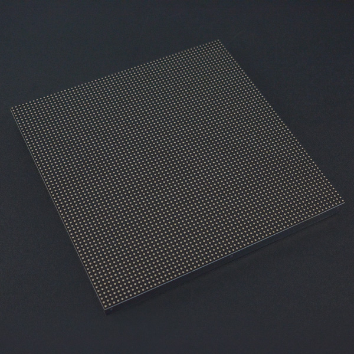

# DFRobot_RGBMatrix

* [中文版](./README_CN.md)
  
这是一个Arduino IDE库，简化RGB灯板的使用，方便使用控制RGB灯板。



## 产品链接 (https://www.dfrobot.com.cn/goods-1504.html)

    SKU: DFR0499

## 目录
  - [概述](#概述)
  - [库安装](#库安装)
  - [方法](#方法)
  - [兼容性](#兼容性)
  - [版本](#版本)
  - [创作者](#创作者)

## 概述
这是一个Arduino IDE库，简化RGB灯板的使用，方便使用控制RGB灯板。

## 库安装

使用此库前，请首先下载库文件，将其粘贴到\Arduino\libraries目录中，然后打开examples文件夹并在该文件夹中运行演示。
## 方法

```C++
  /**
   * @fn customizeZH
   * @brief Chinese character display
   * @param arr Display contents
   * @param fontSize font size (only 16,32 and 64 three options)
   * @param x x-axis
   * @param y  y-axis
   * @param color  color
   */ 	
  void customizeZH(const uint8_t *arr, uint8_t fontSize, uint8_t x, uint8_t y, uint16_t color);

  /**
   * @fn begin
   * @brief init function
   * @return None
   */ 
  void  begin(void);
	
  /**
   * @fn drawPixel
   * @brief 像素点绘制
   * @param x 像素X坐标
   * @param y 像素Y坐标
   * @param c 像素颜色
   */ 
  void drawPixel(int16_t x, int16_t y, uint16_t c);

  /**
   * @fn fillScreen
   * @brief 屏幕颜色填充
   * @param c 填充得颜色
   * @return None 
   */
  void fillScreen(uint16_t c);

  /**
   * @brief 
   * @param copy
   * @return None 
   */
  void swapBuffers(boolean copy);

  /**
   * @fn dumpMatrix
   * @brief 将显示的数据转到串口数据
   * @return None
   */
  void dumpMatrix(void);

  /**
   * @fn backBuffer
   * @brief Return address of back buffer
   * @return Return address of back buffer
   */
  uint8_t* backBuffer(void);

  /**
   * @fn Color333
   * @brief 将RGB333转换为RGB565
   * @param r 红色
   * @param g 绿色
   * @param b 蓝色
   * @return 返回转换后颜色
   */
  uint16_t  Color333(uint8_t r, uint8_t g, uint8_t b);

  /**
   * @fn Color444
   * @brief 将RGB444转换为RGB565
   * @param r 红色
   * @param g 绿色
   * @param b 蓝色
   * @return 返回转换后颜色
   */
  uint16_t  Color444(uint8_t r, uint8_t g, uint8_t b);

  /**
   * @fn Color888
   * @brief 将RGB888转换为RGB565
   * @param r 红色
   * @param g 绿色
   * @param b 蓝色
   * @return 返回转换后颜色
   */
  uint16_t  Color888(uint8_t r, uint8_t g, uint8_t b);

  /**
   * @fn Color888
   * @brief 将RGB888转换为RGB565
   * @param r 红色
   * @param g 绿色
   * @param b 蓝色
   * @param gflag 是否颜色矫正
   * @return 返回转换后颜色
   */
  uint16_t  Color888(uint8_t r, uint8_t g, uint8_t b, boolean gflag);

  /**
   * @fn ColorHSV
   * @brief 设置颜色饱和度
   * @param hue 色调
   * @param sat 饱和度
   * @param val 亮度值
   * @param gflag 是否颜色矫正
   * @return 返回转换后颜色
   */
  uint16_t  ColorHSV(long hue, uint8_t sat, uint8_t val, boolean gflag);

  /**
   * @fn updateDisplay
   * @brief 显示计算
   * @return None
   */
  void updateDisplay(void);
```

## 兼容性

MCU                | Work Well    | Work Wrong   | Untested    | Remarks
------------------ | :----------: | :----------: | :---------: | -----
Mega2560           |      √       |              |             | 
## 版本

- 2017/03/22 - V1.0.0版本
- 2022/03/23 - V1.0.1版本

## 创作者

Written by Tangjie (jie.tang@dfrobot.com), 2022. (Welcome to our [website](https://www.dfrobot.com/))


